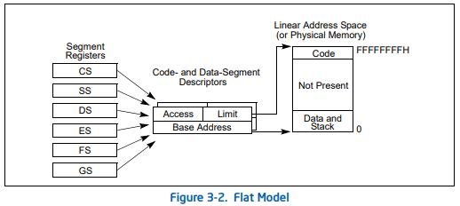

# 2. 保护模式内存管理

## 2.1 内存管理概览
在保护模式下，内存管理涉及三种地址类型：逻辑地址、线性地址和物理地址。理解它们之间的转换是深入掌握x86架构的基础。

### 1. 逻辑地址（Logical Address）
- **定义**：逻辑地址是程序使用的虚拟地址，由两部分组成：**段选择子（Segment Selector）**和**段内偏移（Offset）**。
  - 段选择子：一个16位值，用于指定段寄存器的内容，指向描述符表中的一个条目。它包含三部分：索引、TI（表指示符），和RPL（请求特权级）。
  - 段内偏移：是段内的偏移量，用来确定段内某个位置的数据。
- **作用**：逻辑地址是程序员在代码中使用的地址形式。通过逻辑地址，程序可以访问不同的段（如代码段、数据段、栈段等）。

### 2. 线性地址（Linear Address）
- **定义**：线性地址是逻辑地址经过段机制转换后得到的地址，是分页之前的地址形式。
- **转换过程**：
  - CPU 使用段选择子查找**段描述符表（GDT/LDT）**，从中获取段的基址（Base）。
  - 然后将段基址和段内偏移相加，得到线性地址。
- **作用**：线性地址代表了一个平坦的、连续的地址空间，是在段保护机制下产生的地址，用于进一步的分页转换。

### 3. 物理地址（Physical Address）
- **定义**：物理地址是线性地址经过**分页机制**转换后的最终内存地址，是CPU实际访问内存单元时使用的地址。
- **转换过程**：
  - 分页机制通过**页目录（Page Directory）**和**页表（Page Table）**将线性地址映射到物理地址。
  - 页目录和页表存储了页框和页的映射关系，使得线性地址能够转换为实际的物理地址。
- **作用**：物理地址用于直接定位内存中的具体位置，是CPU最终执行存取操作的地址。

### 4. 地址转换流程总结
- 逻辑地址 → 线性地址：通过段选择子、段描述符和段内偏移量完成。
- 线性地址 → 物理地址：通过分页机制映射到实际的物理地址。

---

## 2.2 分段机制
分段机制是x86架构内存管理的基础，在保护模式下，CPU通过分段机制来管理和保护内存。了解不同的分段模型有助于掌握分段在不同应用场景下的使用。

### 1. Basic Flat Model

- **概述**：这是最简单的内存模型，通常在操作系统的内核模式中使用。
- **特征**：
  - 所有代码段和数据段使用相同的段选择子和基址（通常为0），段限长设置为最大值，覆盖整个地址空间。
  - 逻辑地址中的段基址为0，因此逻辑地址和线性地址几乎是相同的。
- **优点**：管理简单，无需频繁调整段基址。
- **应用场景**：常用于单一任务或内核模式下，不需要复杂的段保护。

### 2. Protected Flat Model
- **概述**：在保护模式下使用的平坦模型，它增加了段保护功能。
- **特征**：
  - 段基址仍然是0，段限长较大，代码段、数据段可以有不同的权限设置。
  - 尽管逻辑地址与线性地址直接对应，但通过描述符可以控制段的访问权限和特权级。
- **优点**：可以进行内存保护，防止不合法的内存访问。
- **应用场景**：多任务操作系统中，内核保护和用户态访问控制。

### 3. Multi-Segment Model
- **概述**：多段模型适用于复杂的内存管理场景，通过不同的段来管理和隔离内存区域。
- **特征**：
  - 每个段有独立的基址和限长，可以定义多个段，如代码段、数据段、栈段、堆段等。
  - 通过不同的段选择子来访问这些段，逻辑地址需要通过段选择子和偏移量才能转换成线性地址。
- **优点**：灵活性高，可以针对不同的数据结构和代码片段进行独立的内存管理。
- **应用场景**：需要严格内存管理和隔离的系统，如大型应用程序和操作系统。

---

## 2.3 逻辑地址和线性地址的转换
- **段选择子（Segment Selectors）**：

  - 是16位的值，其中包含索引、TI（表指示符），以及RPL（请求特权级）。
  - 索引：用于在描述符表（GDT或LDT）中查找段描述符的索引。
  - TI（Table Indicator）：指示该选择子指向GDT（0）还是LDT（1）。
  - RPL（Requested Privilege Level）：指定请求访问的特权级。
  
- **段寄存器（Segment Registers）**：
  - 保存段选择子的寄存器，例如`CS`（代码段寄存器）、`DS`（数据段寄存器）、`SS`（栈段寄存器）等。
  - 当段寄存器加载一个新的段选择子时，CPU 会自动查找GDT/LDT中的段描述符，并更新段寄存器中的基址、限长等信息。

- **段描述符（Segment Descriptors）**：
  - 段描述符存储在GDT或LDT中，每个描述符占用8个字节。
  - 包含段的**基址（Base）**、**限长（Limit）**、**类型（Type）**、**DPL（描述符特权级）**等信息。
  - 基址用于确定段在内存中的起始地址，限长用于限制段的大小。

- **逻辑地址到线性地址的转换步骤**：
  1. 处理器读取逻辑地址中的段选择子。
  2. 通过段选择子中的索引查找GDT/LDT中的段描述符。
  3. 从段描述符中读取段基址。
  4. 将段基址与逻辑地址中的偏移量相加，得到线性地址。

---

## 2.4 描述符的分类
在保护模式下，x86架构定义了多种类型的描述符，用于不同的段和操作。

### 1. 数据段描述符（Data Segment Descriptor）
- **用途**：描述数据段的基址、限长和访问权限。
- **类型字段**：包含段是可读、可写、扩展向上或向下等信息。
- **DPL**：定义数据段的特权级。

### 2. 代码段描述符（Code Segment Descriptor）
- **用途**：描述代码段的基址、限长及执行权限。
- **类型字段**：指明代码段是否可执行、可读和一致性（Conforming）。
- **DPL**：定义可以访问该段的最低特权级。

### 3. 局部描述符表描述符（LDT Segment Descriptor）
- **用途**：描述一个LDT的位置和大小，用于进程或任务的局部段信息。
- **存储位置**：在GDT中，用于指向任务或进程特有的段表。

### 4. 任务状态段描述符（Task-State Segment, TSS Descriptor）
- **用途**：描述TSS的基址和限长，用于多任务切换时保存任务状态。
- **内容**：保存寄存器的状态、堆栈指针、段寄存器等信息。

### 5. 调用门描述符（Call-Gate Descriptor）
- **用途**：用于在不同特权级之间调用子程序。
- **内容**：保存目标代码段选择子、偏移量和参数个数。

### 6. 中断门描述符（Interrupt-Gate Descriptor）
- **用途**：处理外部设备中断，保存中断处理程序的入口地址。
- **类型字段**：标记为中断门，不会自动屏蔽中断。

### 7. 陷阱门描述符（Trap-Gate Descriptor）
- **用途**：用于处理异常和陷阱，与中断门类似，但不会自动屏蔽中断。
- **内容**：保存异常处理程序的入口地址。

### 8. 任务门描述符（Task-Gate Descriptor）
- **用途**：用于任务切换，通过指向TSS来启动新的任务。
- **内容**：保存TSS选择子的索引。

